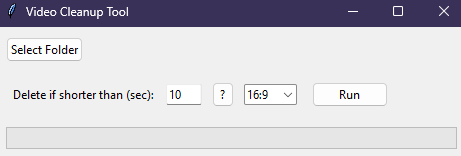

# Why Video Cleanup Tool

After amassing a good amount of thousands of videos made on different mobile devices, spanning across a decade and multiple memory cards
I decided it was time to clean some of them, as many of them where junk under 10 second videos with no real sentimental value.
I thought to myself there are for sure easy ways to do it, like different sorting of the folder, but that was not a good enough solution, as I had videos from different time periods, which means different resolution and different file size.
Thus, this fun little idea came to mind to write a small script that filters and deletes junk videos automatically, keeping the longer ones
based on the metadata of a video file, allowing for broader usage. It was a very fun exercise for me, and it does its job well, so if you need to bulk filter and delete some videos, give this a try!


# Video Cleanup Tool

A simple Python Tkinter application that scans video files in a **single folder** (optionally including subfolders), and:
- Sends to Recycle Bin videos that are shorter than a chosen duration.
- Sends to Recycle Bin videos matching a chosen aspect ratio (or all videos if “All” ratio is selected).
- Uses [FFmpeg](https://ffmpeg.org/) (ffprobe) to gather file metadata.



# Features

1. **GUI Prompt**: Easily select a folder, choose duration threshold, and pick an aspect ratio.
2. **Recycle Bin**: Uses [send2trash](https://pypi.org/project/Send2Trash/) instead of permanently deleting files, so you can always recover them from the Recycle Bin if you made a mistake.
3. **Optional Subfolders**: By default, it can ignore or include subfolders depending on how you configure one line of code.
4. **FFmpeg Integration**: It uses `ffprobe` to read metadata (duration, resolution, etc.).

# Installation & Requirements

1. **Python 3.7+** recommended.
2. **FFmpeg** must be installed and on your systems PATH (so `ffprobe` can be called).  
   - On Windows, download from [FFmpeg.org](https://ffmpeg.org/download.html), extract, and add the `/bin` folder to your PATH.
   - On macOS with Homebrew: `brew install ffmpeg`
   - On Ubuntu/Debian: `sudo apt-get install ffmpeg`
3. **Dependencies**:
   - Install Python dependencies:
     pip install send2trash
     ```
4. **Optional**: If you do not want to run Python directly, download the `.exe` from the [Releases section](#) (or from the repo) for Windows.

# Usage

1. **Run**:
   ```bash
   python VideoCleanupTool.py

2. A small GUI window will appear.
3. Click “Select Folder” to choose your videos folder.
4. Enter a time threshold in seconds (enter 0 to ignore duration).
5. Pick an aspect ratio (or “All”).
6. Hit Run to scan and send matching videos to the Recycle Bin.

# Subfolders:

By default, the script might only scan the top-level folder.
If you want it to include subfolders, open VideoCleanupTool.py and remove (or comment out) the line dirs.clear() in the cleanup_videos function.
Building an .exe:

```bash
    pip install pyinstaller
    pyinstaller --onefile VideoCleanupTool.py
```
Find the .exe in the dist/ folder and share it with others if you want. (They still need FFmpeg installed.)

